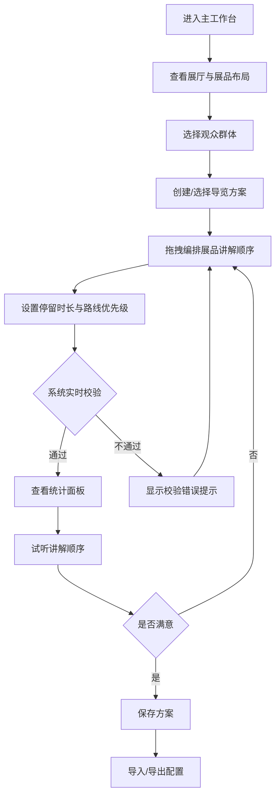

## 1. 产品概述

博物馆语音导览路线编排器，面向博物馆策展与运营人员，提供可视化的导览路线设计工具。支持为不同观众群体创建差异化导览方案，通过拖拽编排讲解顺序、调整停留时长与路线优先级，实时监控总时长、重复路径和跳点情况，提升策展效率与观众体验。

## 2. 核心功能

### 2.1 用户角色

| 角色 | 注册方式 | 核心权限 |
|------|----------|----------|
| 策展人员 | 系统分配账号 | 创建/编辑/删除导览方案、管理展厅展品 |
| 运营人员 | 系统分配账号 | 查看/切换导览方案、导入导出配置、试听讲解 |

### 2.2 功能模块

1. **主工作台页面**：展厅节点画布、展品停靠点管理、路线连接关系、导览方案面板、实时统计面板
2. **方案管理页面**：多方案创建与切换、方案配置编辑、试听顺序切换

### 2.3 页面详情

| 页面名称 | 模块名称 | 功能描述 |
|----------|----------|----------|
| 主工作台 | 展厅节点画布 | 可视化展示展厅节点，支持缩放与平移，展示展厅间连接关系 |
| 主工作台 | 展品停靠点 | 在展厅节点内展示展品列表，支持添加/删除展品，编辑展品信息与停留时长 |
| 主工作台 | 路线连接 | 展示展厅间的连接线路，支持创建/删除连接，标注路线优先级 |
| 主工作台 | 导览方案面板 | 展示当前方案的展品讲解顺序列表，支持拖拽排序 |
| 主工作台 | 实时统计面板 | 实时计算总时长、检测重复路径、识别跳点情况 |
| 主工作台 | 试听控制条 | 按当前方案顺序试听讲解内容，支持暂停/继续/跳转 |
| 主工作台 | 导入导出 | 导出当前路线配置为JSON文件，导入JSON配置文件 |
| 方案管理 | 方案列表 | 按观众群体分类展示所有方案，支持新建/删除/复制方案 |
| 方案管理 | 方案编辑 | 编辑方案名称、目标群体、展品顺序与停留时长 |

## 3. 核心流程

用户在主工作台中查看展厅布局和展品分布，选择目标观众群体后创建导览方案。通过拖拽将展品添加到方案中并调整讲解顺序，设定每站停留时长。系统实时校验路线合法性并计算统计数据。用户可随时切换方案、试听讲解顺序，或导入导出路线配置。

## 4. 用户界面设计

### 4.1 设计风格

- 主色调：深青色(#0F766E) + 暖金色(#D97706)作为点缀，营造博物馆典雅氛围
- 辅助色：石板灰(#475569)用于界面元素，象牙白(#FFFBEB)用于背景
- 按钮风格：圆角(8px)，主要按钮带轻微阴影，悬停有上浮效果
- 字体：展示字体使用 "Playfair Display"（标题），正文使用 "Noto Sans SC"（中文内容）
- 布局风格：左侧画布区域 + 右侧面板的双栏布局，顶部工具栏
- 图标风格：线性图标(lucide-react)，2px描边

### 4.2 页面设计概览

| 页面名称 | 模块名称 | UI元素 |
|----------|----------|--------|
| 主工作台 | 展厅节点画布 | 深色背景画布，展厅以圆角矩形卡片展示，连接线以曲线绘制，缩放和平移控件在右下角 |
| 主工作台 | 导览方案面板 | 右侧固定面板，方案卡片列表支持拖拽排序，每张卡片展示展品名+时长，拖拽手柄在左侧 |
| 主工作台 | 实时统计面板 | 右侧面板顶部，统计数字用大字号展示，异常指标以红色高亮 |
| 主工作台 | 试听控制条 | 底部固定播放条，进度条+播放/暂停按钮+展品名称滚动显示 |
| 主工作台 | 导入导出按钮 | 顶部工具栏右侧，图标+文字按钮，导入时弹出文件选择器 |
| 方案管理 | 方案列表 | 中央卡片网格布局，每张卡片展示方案名称、群体标签、展品数量、总时长 |

### 4.3 响应式设计

- 桌面端优先设计，最小宽度1280px
- 画布区域自适应窗口大小
- 右侧面板固定宽度360px，可折叠
- 平板端(768-1280px)面板切换为抽屉式

### 4.4 3D场景指引

不适用
