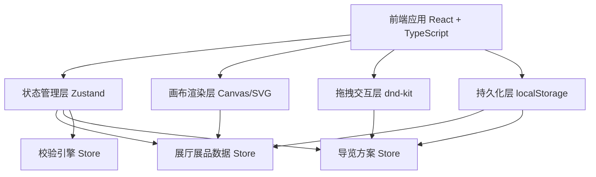
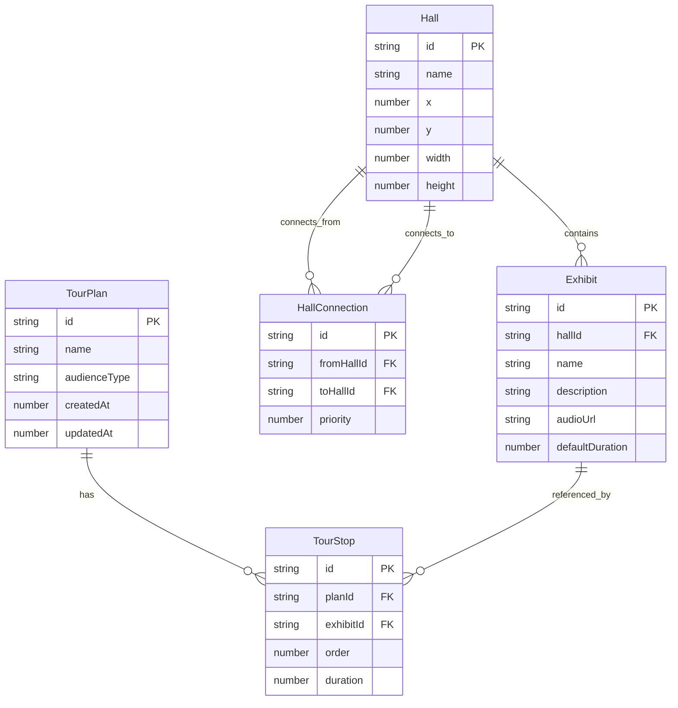

## 1. 架构设计



## 2. 技术说明

- 前端：React@18 + TypeScript + Tailwind CSS@3 + Vite
- 初始化工具：vite-init
- 后端：无（纯前端项目，数据存储在 localStorage）
- 数据库：无（使用 localStorage 做本地持久化）
- 状态管理：Zustand
- 拖拽库：@dnd-kit/core + @dnd-kit/sortable
- 图标库：lucide-react
- 动画库：framer-motion

## 3. 路由定义

| 路由 | 用途 |
|------|------|
| / | 主工作台页面，包含展厅画布、方案面板、统计面板、试听控制 |
| /plans | 方案管理页面，展示所有导览方案列表，支持创建/编辑/删除/复制 |

## 4. API定义

无后端API，所有数据操作通过 Zustand Store 完成。

## 5. 服务端架构图

不适用

## 6. 数据模型

### 6.1 数据模型定义



### 6.2 数据定义语言

使用 TypeScript 接口定义：

```typescript
interface Hall {
  id: string;
  name: string;
  x: number;
  y: number;
  width: number;
  height: number;
}

interface Exhibit {
  id: string;
  hallId: string;
  name: string;
  description: string;
  audioUrl: string;
  defaultDuration: number;
}

interface HallConnection {
  id: string;
  fromHallId: string;
  toHallId: string;
  priority: number;
}

type AudienceType = 'children' | 'general' | 'research';

interface TourPlan {
  id: string;
  name: string;
  audienceType: AudienceType;
  stops: TourStop[];
  createdAt: number;
  updatedAt: number;
}

interface TourStop {
  id: string;
  exhibitId: string;
  order: number;
  duration: number;
}

interface RouteConfig {
  halls: Hall[];
  exhibits: Exhibit[];
  connections: HallConnection[];
  plans: TourPlan[];
}
```
